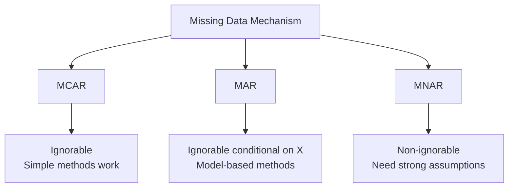
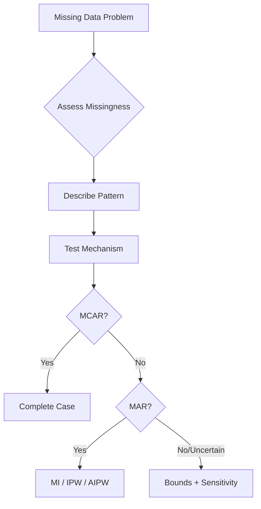

# Missing Data and Selection (MOC)

> [!summary] Overview
> Methods for handling missing data and selection bias in statistical and econometric analyses. Selection and missing data problems are fundamentally about what we don't observe—and how what we don't observe might differ systematically from what we do.

## Core Problem

We want to learn about a population, but we only observe a selected sample:
- **Missing outcomes**: Y not observed for some units
- **Missing covariates**: X partially observed
- **Sample selection**: Entire units missing
- **Attrition**: Units drop out over time

The selection problem:
$$
\mathbb{E}[Y^* \mid R=1] \neq \mathbb{E}[Y^*]
$$

where $R_i \in \{0,1\}$ indicates whether unit $i$ is observed.

## Types of Missingness (Rubin's Classification)

### MCAR (Missing Completely At Random)
$$
P(R = 1 \mid Y^*, X) = P(R = 1)
$$
Missingness independent of everything. Complete cases are representative.

### MAR (Missing At Random)
$$
P(R = 1 \mid Y^*, X) = P(R = 1 \mid X)
$$
Missingness independent of Y conditional on X. Ignorable given observables.

### [[Missing Not At Random (MNAR)|MNAR]] (Missing Not At Random)
$$
P(R = 1 \mid Y^*, X) \text{ depends on } Y^*
$$
Missingness depends on unobserved values. Non-ignorable—requires strong assumptions or bounds.

**Testing**: Compare covariate distributions for R=1 vs R=0 (t-tests, KS tests). If covariates differ, MCAR is rejected. Predicting R from X (logistic/RF AUC) assesses MAR predictability. MNAR is fundamentally untestable.

## Key Problems and Solutions

### [[selection bias]]
When the observed sample differs systematically from the population. Types: sample selection, survivorship bias, publication bias, Berkson's paradox.

### [[Attrition]]
Units dropping out of longitudinal studies. Patterns: monotone (once out, stay out), non-monotone, differential (treatment affects dropout). Solutions: [[Inverse Probability of Censoring Weighting (IPCW)|IPCW]], joint modeling, bounds.

### [[bad controls]]
Variables that shouldn't be conditioned on: post-treatment variables, colliders, mediators. See dedicated note.

## Identification Strategies

### Bounds Approaches

**[[Lee bounds]]** — for sample selection with monotonicity (treatment weakly increases or decreases selection). Trim the higher-selection arm to match rates:
$$
ATT \in \big[\mu_1^{LB} - \mu_0,\ \mu_1^{UB} - \mu_0\big]
$$
where trimmed means remove the top/bottom Δ fraction. See [[Lee bounds]] for the full algorithm.

**[[Manski bounds]]** — worst-case bounds without assumptions:
$$
\mathbb{E}[Y \mid R=1] \cdot P(R=1) + Y_{\min} \cdot P(R=0) \leq \mathbb{E}[Y] \leq \mathbb{E}[Y \mid R=1] \cdot P(R=1) + Y_{\max} \cdot P(R=0)
$$

### Weighting Methods

**[[Inverse Probability Weighting (IPW)|IPW]]** — weight observations by inverse of selection probability:
$$
\hat{\mu} = \frac{1}{n} \sum_{i=1}^n \frac{R_i Y_i}{\hat{P}(R_i = 1 \mid X_i)}
$$

**[[Inverse Probability of Censoring Weighting (IPCW)|IPCW]]** — for time-varying attrition: $w_i(t) = \prod_{s=1}^t \frac{1}{\hat{P}(C_i > s \mid C_i \geq s, \bar{X}_i(s))}$

**[[Augmented Inverse Probability Weighting (AIPW)|AIPW]]** — doubly robust, combines outcome modeling and weighting:
$$
\hat{\mu}_{\text{AIPW}} = \frac{1}{n} \sum_{i=1}^n \left[ \frac{R_i Y_i}{\hat{e}(X_i)} - \frac{R_i - \hat{e}(X_i)}{\hat{e}(X_i)} \hat{m}(X_i) \right]
$$
Consistent if either the selection model or outcome model is correct.

### Selection Models (Heckman)

Two-equation system:
- **Selection**: $R_i^* = Z_i'\gamma + u_i, \quad R_i = \mathbf{1}(R_i^* > 0)$
- **Outcome**: $Y_i = X_i'\beta + \epsilon_i$, observed if $R_i = 1$

Key assumption: joint normality of errors. Requires an exclusion restriction (variable in Z not in X).

## Missing Data Imputation

| Method | Assumption | Use Case |
|--------|------------|----------|
| Complete case | MCAR | Small % missing |
| Mean imputation | MCAR | Never recommended |
| Multiple imputation | MAR | General purpose |
| Hot deck | Similar units | Surveys |

**Multiple imputation** (MI): generate m imputed datasets, analyze each, pool via Rubin's rules:
$$
\hat\theta = \frac{1}{m}\sum_{j=1}^m \hat\theta_j, \quad V = \bar W + (1 + 1/m)\, B
$$
where $\bar W$ = within-imputation variance, $B$ = between-imputation variance.

## Sensitivity Analysis

When MAR is questionable, assess robustness:
- **Tipping point analysis**: How much selection bias would overturn the conclusion?
- **Rosenbaum bounds**: Sensitivity to unobserved confounding in matched designs
- **Pattern mixture models**: Model outcomes separately for different missingness patterns, vary assumptions about unobserved

## Practical Workflow

## Checklist

> [!check] Missing Data Analysis
> - [ ] Report number and percentage missing by variable
> - [ ] Test missingness mechanism (compare R=1 vs R=0 on covariates)
> - [ ] Choose method appropriate to mechanism (complete case / MI / IPW / bounds)
> - [ ] For MI: use ≥20 imputations, check convergence, pool via Rubin's rules
> - [ ] For IPW/AIPW: check overlap, clip extreme weights
> - [ ] Conduct sensitivity analysis (tipping point, bounds, pattern mixture)
> - [ ] Report complete-case results for comparison
> - [ ] Document assumptions and justify them

> [!warning] Pitfalls
> - Ignoring missing data or using complete cases without testing MCAR
> - Single imputation (ignores uncertainty)
> - LOCF (last observation carried forward) in longitudinal studies
> - Assuming MAR without justification
> - Imputing the outcome in prediction models

## Key Packages

- **R**: `mice` (MI), `VIM` (visualization), `sampleSelection` (Heckman), `naniar` (exploration)
- **Python**: `sklearn.impute.IterativeImputer` (MICE), `statsmodels` (Heckman), `missingno` (viz)
- **Stata**: `mi impute`, `mi estimate`, `heckman`, `teffects ipw/aipw`

---

Related notes to create:
- [[MCAR]]
- [[MAR]]
- [[FIML]]
- [[pattern mixture models]]
- [[selection models]]
- [[auxiliary variables]]
