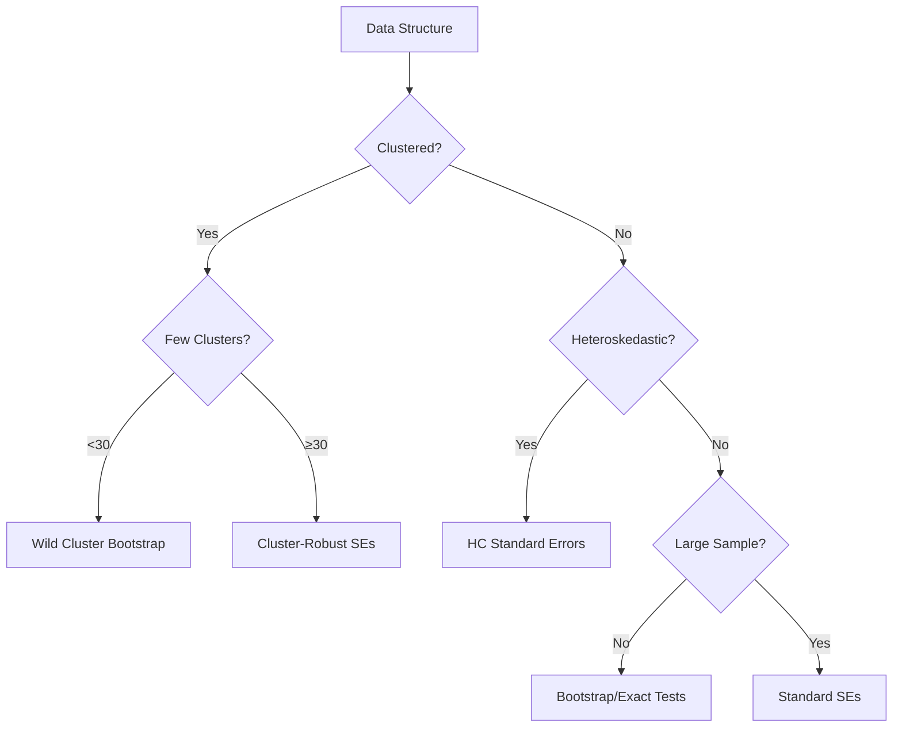

# Standard Errors and Inference (MOC)

> [!summary] Overview
> Methods for quantifying uncertainty and conducting valid inference in econometric and statistical analyses, with special attention to complex data structures, violations of standard assumptions, and finite sample issues. This MOC covers everything from basic standard errors to advanced resampling methods and cluster-robust inference.

## Core Problem

Standard inference assumes:
- Independent observations
- Homoskedasticity
- Large samples
- No spatial/temporal correlation

Real data violates these through:
- Clustering/grouping
- Heteroskedasticity
- Small samples
- Network/spatial effects
- Serial correlation

## Standard Error Fundamentals

### Basic Types
- **OLS standard errors** - Assume iid errors
- **Heteroskedasticity-robust** (HC0-HC3) - White/Eicker-Huber-White
- **HAC** (Heteroskedasticity and Autocorrelation Consistent) - Newey-West

### The Variance-Covariance Matrix
$$
\hat{V}(\hat{\beta}) = (X'X)^{-1} X' \hat{\Omega} X (X'X)^{-1}
$$
Different assumptions about Ω lead to different SE estimators.

## Clustered Data Problems

### [[clustered standard errors]]
When observations are grouped (firms, schools, states):
- Within-cluster correlation → underestimated SEs
- Solution: Allow arbitrary correlation within clusters
- Key insight: Effective sample size ≈ number of clusters, not observations

### [[Moulton problem]]
The severe downward bias in SEs when:
- Regressors vary only at group level
- Outcomes measured at individual level
- Ignoring clustering structure
- **Moulton factor**: $\sqrt{1 + \rho(n_c - 1)}$ inflation needed

### [[few-cluster corrections]]
When number of clusters G < 30-50:
- t-distribution with G-1 df instead of normal
- [[wild cluster bootstrap]] for better size
- Bias-reduced cluster variance estimators (CR2, CR3)

### [[Cameron–Gelbach–Miller]]
Multi-way clustering for multiple dimensions:
- Two-way: firms and time
- Intersection and union approaches
- Variance decomposition: V = V₁ + V₂ - V₁₂

## Spatial and Network Correlation

### [[Conley standard errors]]
For spatial data with distance-based correlation:
- Kernel-based weighting by distance
- Bandwidth selection crucial
- Extends HAC to spatial dimension

### Network effects
- Correlation through network connections
- Exponential decay with network distance
- Special structures (clustered networks)

## Resampling Methods

### [[bootstrap]]
Non-parametric approach to inference:

**Types for different data structures:**
- **Pairs bootstrap** - Resample (Xᵢ, Yᵢ) pairs
- **Residual bootstrap** - Resample residuals
- **Wild bootstrap** - Multiply residuals by random weights
- **Block bootstrap** - For time series, preserve dependence
- **Cluster bootstrap** - Resample entire clusters

**Key advantages:**
- No distributional assumptions
- Works for complex statistics
- Provides entire distribution

### [[wild cluster bootstrap]]
Specifically for few clusters:
- Imposes null hypothesis
- Uses Rademacher or Webb weights
- Better size properties than cluster-robust SEs
- Can handle as few as 5-10 clusters

### [[randomization inference]]
Design-based approach:
- Uses random assignment mechanism
- Exact p-values under sharp null
- No assumptions about error distribution
- Works with any test statistic

## Implementation Strategies

### Choosing the Right Method



### Diagnostic Tests

| Problem | Test | Solution |
|---------|------|----------|
| Heteroskedasticity | Breusch-Pagan, White | Robust SEs |
| Clustering | Compare SEs | Cluster-robust SEs |
| Serial correlation | Durbin-Watson, LM | HAC/Newey-West |
| Few clusters | G < 30 | Wild bootstrap |
| Spatial correlation | Moran's I | Conley SEs |

## Software Implementation

### R Ecosystem
```r
# Basic robust SEs
library(sandwich)    # vcovHC, vcovHAC, vcovCL
library(lmtest)      # coeftest with robust SEs

# Advanced clustering
library(clubSandwich) # CR2, CR3 corrections
library(multiwayvcov) # Multi-way clustering
library(fwildclusterboot) # Wild cluster bootstrap

# Spatial
library(conleyreg)   # Conley standard errors
```

### Python
```python
# statsmodels
import statsmodels.api as sm
# .fit(cov_type='HC3')  # Robust
# .fit(cov_type='cluster', cov_kwds={'groups': clusters})

# linearmodels
from linearmodels import PanelOLS
# Handles various clustering structures

# econml
# For ML-based inference
```

### Stata
```stata
* Basic
reg y x, robust              // HC1
reg y x, cluster(group_var)  // Cluster-robust

* Advanced
reghdfe y x, cluster(id)     // High-dim FE
boottest x, cluster(id)      // Wild cluster bootstrap
ivreg2 y (x=z), conley(10)   // Conley SEs
```

## Common Pitfalls

> [!warning] Mistakes to Avoid
> 1. **Wrong clustering level** - Cluster at level of treatment variation
> 2. **Ignoring few clusters** - Don't use asymptotic theory with G < 30
> 3. **Multiple clustering dimensions** - Consider multi-way clustering
> 4. **Serial correlation in panels** - Cluster by unit, not just time
> 5. **Spatial correlation** - Don't ignore geographic proximity
> 6. **P-hacking** - Don't try multiple SE types and report favorable

## Best Practices Checklist

> [!check] Standard Operating Procedure
> - [ ] Plot residuals to check for heteroskedasticity
> - [ ] Test for serial correlation in panels
> - [ ] Compare OLS vs robust vs clustered SEs
> - [ ] Report number of clusters if clustering
> - [ ] Use conservative approach when uncertain
> - [ ] Pre-specify inference approach
> - [ ] Consider multiple robustness checks
> - [ ] Report all SE specifications tried

## Key Formulas

### Cluster-robust variance
$$
\hat{V}_{\text{cluster}} = (X'X)^{-1} \left(\sum_{g=1}^G X_g' \hat{u}_g \hat{u}_g' X_g \right) (X'X)^{-1}
$$

### Moulton factor
$$
\text{SE}_{\text{true}} = \text{SE}_{\text{naive}} \times \sqrt{1 + \rho(n_c - 1)}
$$

### Wild cluster bootstrap weights
$$
w_g^* \sim \begin{cases}
-1 & \text{with prob } 0.5 \\
+1 & \text{with prob } 0.5
\end{cases}
$$

## Connections to Other Topics

### Related MOCs
- [[Causal Inference (MOC)]] - Valid inference for causal effects
- [[Experimental Design (MOC)]] - Design-based inference
- [[Econometrics (MOC)]] - Core estimation theory
- [[ML for Econometrics (MOC)]] - High-dimensional inference

### Key Prerequisites
- [[Hypothesis testing]]
- [[Central Limit Theorem]]
- [[Law of Large Numbers]]
- [[Variance estimation]]

### Applications in
- [[Difference-in-Differences (DiD)]] - Cluster at treatment level
- [[Regression Discontinuity Design (RDD)]] - Robust inference at cutoff
- [[randomized controlled trial (RCT)]] - Design-based inference
- [[Instrumental Variables (IV)]] - Weak instrument robust inference

## Essential References

### Foundational Papers
- White (1980) - Heteroskedasticity-consistent covariance matrix
- Moulton (1990) - Random group effects and precision
- Bertrand, Duflo, Mullainathan (2004) - How much should we trust DiD?

### Practical Guides
- Cameron & Miller (2015) - A practitioner's guide to cluster-robust inference
- MacKinnon & Webb (2017) - Wild bootstrap inference for wildly different cluster sizes
- Abadie et al. (2023) - When should you adjust standard errors for clustering?

### Advanced Topics
- Conley (1999) - GMM estimation with cross sectional dependence
- Canay, Romano, Shaikh (2017) - Randomization tests under approximate symmetry
- Roodman et al. (2019) - Fast and wild: Bootstrap inference in Stata

## Quick SE Comparison

```r
# R: Compare SE types for a fitted model
library(sandwich); library(lmtest)
coeftest(fit, vcov = vcovHC(fit, type = "HC3"))      # Robust
coeftest(fit, vcov = vcovCL(fit, cluster = ~ group))  # Clustered
```

```python
# Python: Robust and clustered SEs
res = sm.OLS(y, X).fit(cov_type='HC3')                # Robust
res = sm.OLS(y, X).fit(cov_type='cluster', cov_kwds={'groups': g})  # Clustered
```

---

Related notes to create:
- [[heteroskedasticity-robust standard errors]]
- [[Newey–West|HAC standard errors]]
- [[CR2 and CR3 corrections]]
- [[effective sample size]]
- [[randomization inference|design-based inference]]
- [[finite sample corrections]]